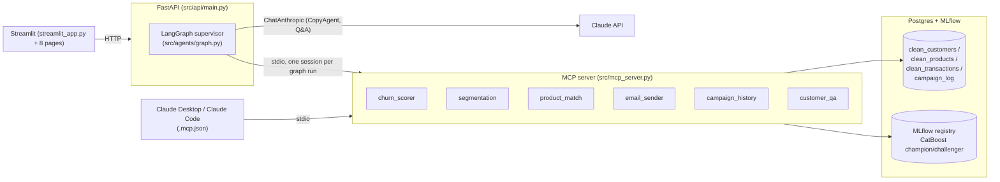

# MarketMind AI

Agentic marketing automation platform: a CatBoost churn model feeds a LangGraph
multi-agent pipeline that segments customers, drafts retention emails with Claude,
answers natural-language questions over the data, and retrains itself with a
PSI-based drift gate and a human promotion gate — all surfaced through a
multi-page Streamlit UI. Zero-budget stack: Postgres, MLflow (SQLite backend),
CatBoost, Claude API, SendGrid, Streamlit.

Portfolio project — see `TODO.txt` for the original architecture notes and
`MarketMind_AI_Platform_Plan.pdf` (kept out of the repo) for the initial design doc
this build reconciled against.

## Architecture



**Why MCP.** The tool layer (`src/mcp_tools/*.py`) is implemented once, as an MCP
server, and reached two ways: the LangGraph agent calls it over stdio
(`src/agents/mcp_client.py`), and the repo-root `.mcp.json` lets Claude Desktop or
Claude Code call the exact same tools directly — e.g. ask Claude Desktop "what's our
current high-risk segment?" and it queries this platform's own data, no UI required.

## Quick start

### Docker Compose (fastest — Postgres, API, and UI in one command)

```bash
docker compose -f deployment/docker-compose.yml up --build
```

- Streamlit: http://localhost:8501
- API: http://localhost:8000 (docs at `/docs`)
- Postgres auto-seeds from `data/sample_data.sql` on first boot.
- Set `ANTHROPIC_API_KEY` / `SENDGRID_API_KEY` in your shell before `up` to enable
  live LLM drafting / real email sends — both are optional and degrade gracefully
  (CopyAgent falls back to a static template; email sends default to `dry_run`).
- **First run only:** train and promote a first churn model —
  `docker compose -f deployment/docker-compose.yml exec api python -m ml.retrain`

### Local dev (no Docker)

```bash
python -m venv venv && venv\Scripts\activate   # or source venv/bin/activate
pip install -r requirements.txt
cp .env.example .env   # fill in DB_* (and optionally ANTHROPIC_API_KEY, SENDGRID_API_KEY)

# seed Postgres once (or apply data/sample_data.sql with any Postgres client)
python -c "from src.db.config import Base, engine; Base.metadata.create_all(engine)"

python -m ml.retrain                                          # train + promote v1
python -m uvicorn src.api.main:app --reload --port 8000       # terminal 1
streamlit run streamlit_app.py                                 # terminal 2
```

The MCP server itself doesn't need to be started separately — the graph and Claude
Desktop/Code both spawn `python -m src.mcp_server` on demand. To run it standalone
for testing: `python -m src.mcp_server`.

## The three workflows

1. **Churn → email campaign** — `DataAgent → ScoringAgent → CopyAgent → SendAgent →
   ReportAgent`, driven by the LangGraph supervisor (`src/agents/graph.py`). Trigger
   from the Dashboard's "Run churn workflow" button, or `POST /chat {"message": "demo
   full"}`.
2. **Customer intelligence Q&A** — natural-language question → Claude generates
   read-only SQL (validated against an allow-list of the 3 core tables) → executes →
   Claude narrates the result. `src/mcp_tools/qa_sql_tool.py`, the Customer Q&A page,
   or `POST /qa`.
3. **Model retraining & drift monitoring** — PSI drift gate (only retrains when a
   monitored feature has moved > 0.10 vs. the last run's baseline), a temporal
   train/test split, and a human promotion gate in the Model Hub page. `ml/retrain.py`
   + `ml/drift.py`.

## Streamlit pages

| Page | Purpose |
|---|---|
| Dashboard | Live churn metrics, at-risk table, one-click full workflow run |
| Segmentation | Filterable churn-score table |
| Campaigns | Target a segment, preview CopyAgent drafts, dispatch |
| Email Review | Per-email approve/skip queue before sending |
| Customer Q&A | Chat over customer/product/transaction data |
| Analytics | Campaign send log + template breakdown |
| Model Hub | Champion vs. challenger, promote (human gate), trigger retrain |
| Settings | Read-only view of effective backend thresholds |

## Known limitations

- **CatBoost's ONNX exporter doesn't support categorical features** (a CatBoost
  limitation, not this app's), so the ONNX export step in `ml/retrain.py` is
  best-effort and currently always falls back — serving stays on the native
  CatBoost/MLflow path (`ml/score_churn.py`).
- **MCP subprocess spawn cost**: each node that calls an MCP tool opens one stdio
  session (kept for that node's own tool calls, per anyio's cancel-scope rules — see
  the docstring in `src/agents/mcp_client.py`). A `demo full` run costs ~2 spawns;
  each re-imports pandas/mlflow/catboost, so expect ~10-50s rather than sub-second.
- **Campaign open/click tracking** (`campaign_log.opened`/`.clicked`) has columns but
  no SendGrid event webhook wired up yet — they stay `false`.
- **Point-in-time feature correctness**: `as_of_end_date` now bounds which
  transactions and dates feed each feature (fixed a real data-leakage bug — see
  `git log` on `src/data_pipeline/preprocess.py`), but features are still computed
  once per training run, not with true leave-one-out point-in-time correctness per
  row. Good enough for a portfolio demo; flag before using this pattern in production.

## Testing

```bash
pytest tests/                      # unit tests only (default, see pytest.ini)
pytest tests/ -m integration       # + needs a live Postgres and a Production model
```

## Portfolio notes

- Point `MLFLOW_TRACKING_URI` at a [DagsHub](https://dagshub.com) repo instead of
  the local SQLite file to get a public, shareable experiment log.
- `scripts/generate_sample_data_sql.py` regenerates `data/sample_data.sql` from
  `data/*.csv` if the source data changes (`data/` itself is gitignored).
- `deployment/github_actions.yml` needs to be copied to `.github/workflows/` to
  activate — GitHub only picks up workflows from that exact path.
